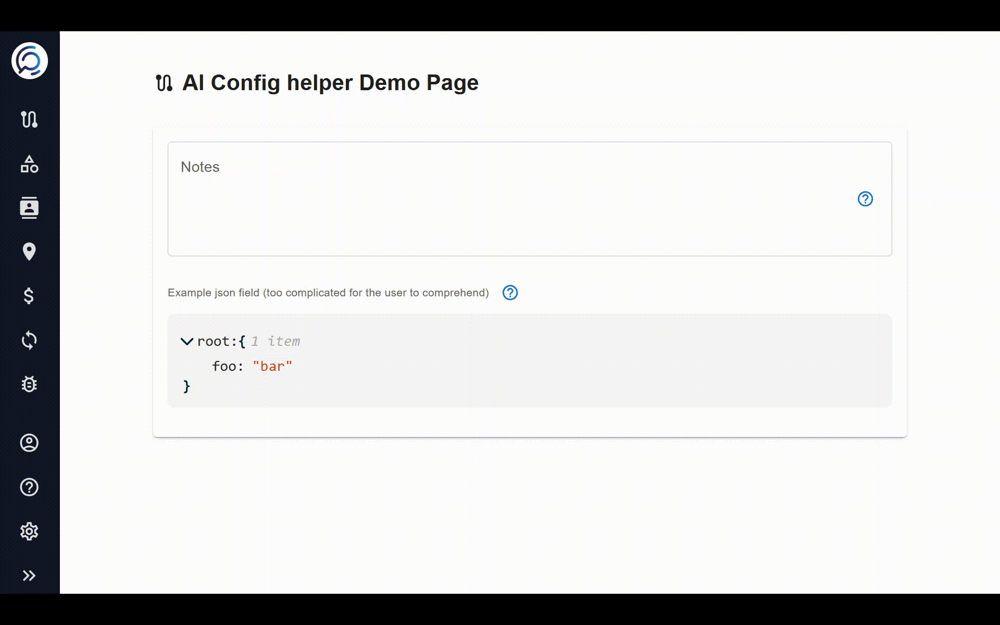

# React AI Config Helper

A React component for AI-assisted field configuration in forms. This package provides a chat-like interface that can be attached to any form field to offer AI-powered assistance.

Use it to help user fill complex forms or complicated configurations using Lovable-like chat experience.

[](https://www.npmjs.com/package/react-ai-config-helper)
[](https://github.com/lucarillosi/react-ai-config-helper/blob/main/LICENSE)



## Features

- 🤖 AI-powered field configuration assistance
- 💬 Chat interface for interacting with the AI
- 🎯 Easily attach to any form field
- 🎨 Customizable styling
- 📋 One-click value application
- 🔌 Plug in your own AI service or use mock responses

## Use cases

- 🧩 Form Assistance: Guide users through complex or technical fields with AI.

- 🚀 Faster Onboarding: Fill multiple fields quickly via natural language.

- 🛠️ Schema Editors: Edit JSON/YAML/configs without knowing the syntax.

- 📄 Template Builders: Create or refine docs and templates through chat.

- ⚙️ No-Code Tools: Turn config fields into AI-assisted editors.

- 💻 Dev Tools: Add smart suggestions to developer-focused UIs.

## Installation

```bash
# npm
npm install react-ai-config-helper

# yarn
yarn add react-ai-config-helper
```

## Peer Dependencies

This package requires the following peer dependencies:

```
react: ^17.0.0 || ^18.0.0
react-dom: ^17.0.0 || ^18.0.0
@mui/material: ^5.0.0
@mui/icons-material: ^5.0.0
@emotion/react: ^11.0.0
@emotion/styled: ^11.0.0
```

## Usage

### Basic Usage

```jsx
import { AiConfigHelper } from "react-ai-config-helper";
import { TextField } from "@mui/material";

function MyForm() {
  const [value, setValue] = React.useState("");

  return (
    <div style={{ position: "relative" }}>
      <TextField
        label="Notes"
        value={value}
        onChange={(e) => setValue(e.target.value)}
        fullWidth
        InputProps={{
          endAdornment: (
            <AiConfigHelper
              fieldId="notes"
              fieldName="Notes"
              onApplyValue={(newValue) => setValue(newValue)}
            />
          ),
        }}
      />
    </div>
  );
}
```

### With JSON Editor

```jsx
import { AiConfigHelper } from "react-ai-config-helper";
import { JsonEditor } from "your-json-editor-library";

function MyJsonForm() {
  const [schema, setSchema] = React.useState({ type: "object" });

  return (
    <div>
      <div style={{ display: "flex", alignItems: "center" }}>
        <label>JSON Schema</label>
        <AiConfigHelper
          fieldId="schema"
          fieldName="JSON Schema"
          onApplyValue={(newValue) => setSchema(newValue)}
        />
      </div>
      <JsonEditor
        value={schema}
        onChange={(newSchema) => setSchema(newSchema)}
      />
    </div>
  );
}
```

### With Custom API Integration

```jsx
import { AiConfigHelper } from "react-ai-config-helper";

function MyFormWithCustomAI() {
  const [value, setValue] = React.useState("");

  // Define your custom API handler
  const handleSendMessage = async (message) => {
    // Call your AI service
    const response = await fetch("https://your-ai-service.com/api", {
      method: "POST",
      headers: { "Content-Type": "application/json" },
      body: JSON.stringify({ query: message, fieldType: "text" }),
    });

    const data = await response.json();

    // Return in the expected format
    return {
      payload: data.suggestion,
    };
  };

  return (
    <div>
      <TextField
        label="Custom Field"
        value={value}
        onChange={(e) => setValue(e.target.value)}
        InputProps={{
          endAdornment: (
            <AiConfigHelper
              fieldId="custom"
              fieldName="Custom Field"
              onApplyValue={(newValue) => setValue(newValue)}
              onSendMessage={handleSendMessage}
              welcomeMessage="Hello! I'm your custom AI assistant. How can I help you today?"
            />
          ),
        }}
      />
    </div>
  );
}
```

## Props

| Prop              | Type                                   | Default                                                                             | Description                                            |
| ----------------- | -------------------------------------- | ----------------------------------------------------------------------------------- | ------------------------------------------------------ |
| `fieldId`         | string                                 | (required)                                                                          | Unique identifier for the field                        |
| `fieldName`       | string                                 | (required)                                                                          | Display name of the field to show in the helper        |
| `onApplyValue`    | function                               | undefined                                                                           | Callback for when a value is selected to be applied    |
| `placement`       | "top" \| "bottom" \| "left" \| "right" | "right"                                                                             | Position of the helper popover relative to the trigger |
| `icon`            | ReactNode                              | `<HelpOutlineIcon />`                                                               | Custom icon to use for the helper trigger button       |
| `onSendMessage`   | function                               | undefined                                                                           | Custom function to handle API requests                 |
| `welcomeMessage`  | string                                 | "Hi there! I'm AiConfigHelper. How can I help you configure the [fieldName] field?" | Custom welcome message                                 |
| `helpButtonLabel` | string                                 | "Get AI assistance"                                                                 | Custom button text for the help button                 |
| `styles`          | object                                 | `{}`                                                                                | Custom styles for the component                        |

### Styles Object Properties

| Property                | Type   | Default        | Description                                |
| ----------------------- | ------ | -------------- | ------------------------------------------ |
| `width`                 | number | 320            | Width of the chat popup in pixels          |
| `maxHeight`             | number | 400            | Maximum height of the chat popup in pixels |
| `userMessageColor`      | string | "primary.main" | Background color of user messages          |
| `userMessageTextColor`  | string | "white"        | Text color of user messages                |
| `assistantMessageColor` | string | "grey.100"     | Background color of assistant messages     |

## License

MIT
